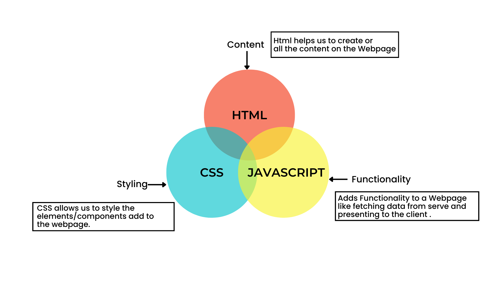

# My home task for JavaScript course📚

```
Викладач Брила Андрій Юрійович, кандидат фізико-математичних наук, доцент.

Досвід викладання мов програмування - з 2000 року.

```


```

1. use strict; //file js

2. type="module" //file html

```

- `JavaScript course📚`[**Урок №1 (Вступ)**](https://youtube.com/live/fnJfUNaDpEc?feature=share)
  `Home task`
  [**Домашнє завдання №1**](https://drive.google.com/drive/folders/1-luVq8_1syEQ-QTTdRruHWxvd0eNGtVJ?usp=sharing)

  - `JavaScript course📚`[**Урок №1 (Вступ)**](https://youtube.com/live/fnJfUNaDpEc?feature=share)
    `Home task`
    [**Домашнє завдання №1**](https://drive.google.com/drive/folders/1-luVq8_1syEQ-QTTdRruHWxvd0eNGtVJ?usp=sharing)

# Javascript Basics For Beginners

- Here what ever is thought is the very basics of Javascript. Which is very is
  easy and simple.

<br>

> **Lets first learn what actual javascript and what is its latest version.**

Javascript is a scripting language which can be used both as Frontend and
Backend lang. Javascript is mostly used to develop all sort of WebApplication
Javascript adds a functionality to a WebApplication like fetching data from the
server and Changing the website element styling dynamically.

<br>

> What is the Role of Javascript in Web Development?

Javascript act as backend and is used to communicate with the server. Send and
Recieve data from the server and present it to the client. Javascript is used to
create dynamic webpages.



<br>

> Why Should you choose Javascript?

Well, Javascript is a very powerful language which can be used to create dynamic
webpages with just minimal effort and code. You Won't Take allot of time to
learn Javascript.

<br>

> Version of Javascript we are using from ES6 to ES11.

<br>

> What is ES6?

ES Stands for ECMA Script which is a javascript standard to ensure the
connection between the browser and the server. ES6 is a known as the start for
_Modern Javascript_ before this till ES5 it was Old Javascript which lacked
allot of buildin functions.

<br>

_ECMA Script Versions and Release Dates_ | Version | Release Date | Description
| |:-------:|:-----------:|:------------:| | ES1 | 1997 |First edition| | ES2 |
1998 |Editorial changes to keep the specification fully aligned with ISO/IEC
16262 international standard| | ES3 | 1999 |Added regular expressions, better
string handling, new control statements, try/catch exception handling, tighter
definition of errors, formatting for numeric output, and other enhancements| |
ES4 | 2003 |Fourth Edition was abandoned, due to political differences
concerning language complexity. Many features proposed for the Fourth Edition
have been completely dropped; some were incorporated into the sixth edition.| |
ES5 | 2009 |Adds "strict mode," a subset intended to provide more thorough error
checking and avoid error-prone constructs. Clarifies many ambiguities in the 3rd
edition specification, and accommodates behavior of real-world implementations
that differed consistently from that specification. Adds some new features, such
as getters and setters, library support for JSON, and more complete reflection
on object properties. | |ES5.1 | 2011 |This edition 5.1 of the ECMAScript
standard is fully aligned with the third edition of the international standard
ISO/IEC 16262:2011.| Modern Javascript | | ES6 | 2015 | | ES7 | 2016 | | ES8 |
2017 | | ES9 | 2018 | | ES10 | 2019 | | ES11 | 2020 | | ES12 | 2021 |

<br>
Where Else is Javascript Used? Is it only used to create dynamic webpages?

NOPE! Javascript can be used to create Mobile applications, ios, Android
applications, Server-side Applications, native applicatio, Desktop Applications,
Games, and many more. Andddd once you are a pro in Javascript you can play with
it and you would know it better what to do with it.

What are Javascript Libraries & Frameworks?

Libraries and frameworks work as a readymade structure which just need to be
installed and used. Frameworks are used to create a better and more efficient
way to create a website. They save a lot of time and effort. The code is clean
and easy to understand. You will learn more about them in future as you go
deeper into Javascript.

Some of the most used Javascript Libraries and Frameworks are:

|   Library    |                                                            Icon                                                             |
| :----------: | :-------------------------------------------------------------------------------------------------------------------------: |
|   React.js   |                |
| React Native |  |
|  Angular.js  |              |
|    Vue.js    |            |
|  Bootstrap   |        |
|   Node.js    |                      |
|  Express.js  |    |
|   Next.js    |                         |
|  Iconic.js   |                         |
| Electron.js  |               |

<br>
What are these frameworks used for?

- **React.js** : is used to create fully dynamic, animated, and interactive
  webpages.

- **React Native** : is used to create cross platform applications. Which means
  you just have to code for one platform and React native will automatically
  fetch the code for the rest other platform.

- **Electron.js** : is used to create dynamic, robust desktop apps for MacOs,
  Windows and Linux
- **Node.js** : Is used to create efficient server side applications
